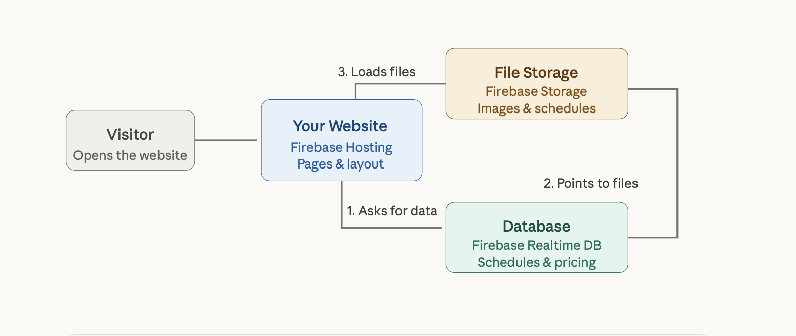

## Website Architecture
The public-facing website is served via Firebase Hosting.

Dynamic content — including course schedules, pricing, and images — is loaded at runtime from a Firebase Realtime Database, which stores pricing and schedule data directly and holds references to static files (images and downloadable schedules) hosted in Firebase Storage.